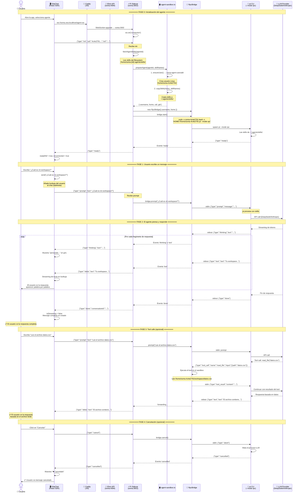

# Diagrama de Secuencia — Chat Soma x Südlich

> Flujo completo: desde que el usuario escribe un mensaje hasta que ve la respuesta.



---

## 🗺️ Mapa de puertos y rutas

```
┌─────────────────────────────────────────────────────────┐
│  NAVEGADOR                                               │
│  http://sudlich-soma.zea.localhost                       │
│                                                          │
│  GliaChat                                                │
│  ├─ HTTP :80  → Caddy → sudlich-soma:3099 (frontend)    │
│  ├─ REST     → Caddy → soma:4084 (Elixir API)           │
│  └─ WS       → Caddy → soma:3002 (Pi Sidecar) ⚡         │
└─────────────────────────────────────────────────────────┘
                          │
                          ▼
┌─────────────────────────────────────────────────────────┐
│  CADDY (:80)                                             │
│  /agent-ws     → soma:3002  (WebSocket agentes)          │
│  /api/*        → soma:4084  (REST API)                   │
│  /*            → soma:4084  (SPA fallback)                │
└─────────────────────────────────────────────────────────┘
                          │
                          ▼
┌─────────────────────────────────────────────────────────┐
│  CONTENEDOR SOMA (Alpine Linux)                          │
│                                                          │
│  ┌─────────────────────┐  ┌──────────────────────────┐  │
│  │ Elixir API (:4084)  │  │ Pi Sidecar (:3002)       │  │
│  │                     │  │                          │  │
│  │ /health             │  │ ws.on('init')            │  │
│  │ /api/conversations  │  │   → fetchAgentSkills()   │  │
│  │ /api/files          │  │   → prepareAgent()       │  │
│  │ /api/skills         │  │   → new RpcBridge()      │  │
│  │ /api/agents         │  │                          │  │
│  │ /api/sandboxes      │  │ ws.on('prompt')          │  │
│  │                     │  │   → bridge.prompt()      │  │
│  │ PostgreSQL ◄────────┼──┤                          │  │
│  └─────────────────────┘  │ ws.on('cancel')          │  │
│                            │   → bridge.cancel()      │  │
│  ┌─────────────────────┐  └──────────┬───────────────┘  │
│  │ Sandbox Layer (OS)  │             │                   │
│  │                     │             ▼                   │
│  │ /home/soma-{id}/    │  ┌──────────────────────────┐  │
│  │   workspace/        │  │ RpcBridge                │  │
│  │   .agents/skills/   │  │                          │  │
│  │   .pi-sessions/     │  │ sudo -u soma-{id} \      │  │
│  │                     │  │   pi --mode rpc          │  │
│  │ chmod 700           │  │                          │  │
│  └─────────────────────┘  │ stdin/stdout JSONL       │  │
│                            └──────────┬───────────────┘  │
│                                       │                   │
│                                       ▼                   │
│                            ┌──────────────────────────┐  │
│                            │ pi CLI (--mode rpc)      │  │
│                            │                          │  │
│                            │ - Lee ~/.agents/skills/  │  │
│                            │ - API keys del entorno   │  │
│                            │ - Llama a LLM provider   │  │
│                            └──────────────────────────┘  │
└─────────────────────────────────────────────────────────┘
```

---

## 📋 Protocolo de mensajes

### Cliente → Servidor (WebSocket JSON)

| Tipo | Campos | Cuándo |
|---|---|---|
| `init` | `uid`, `cid?` | Al abrir el chat |
| `prompt` | `text` | Usuario escribe mensaje |
| `cancel` | — | Usuario clickea cancelar |

### Servidor → Cliente (WebSocket JSON)

| Tipo | Campos | Significado |
|---|---|---|
| `ready` | `message` | Agente inicializado, listo para prompts |
| `thinking` | `text` | El modelo está razonando |
| `delta` | `text` | Fragmento de respuesta (streaming) |
| `tool` | `name`, `input` | El agente llamó una herramienta |
| `done` | `conversationId` | Respuesta completa |
| `cancelled` | — | Generación cancelada |
| `error` | `message` | Error |

### RpcBridge ↔ pi CLI (stdin/stdout JSONL)

| Dirección | Tipo | Uso |
|---|---|---|
| stdin → | `prompt` | Enviar mensaje |
| stdin → | `abort` | Cancelar |
| stdin → | `tool_result` | Resultado de tool |
| stdout ← | `thinking` | Razonamiento |
| stdout ← | `text` | Respuesta |
| stdout ← | `tool_call` | Llamada a herramienta |
| stdout ← | `done` | Terminado |
```
