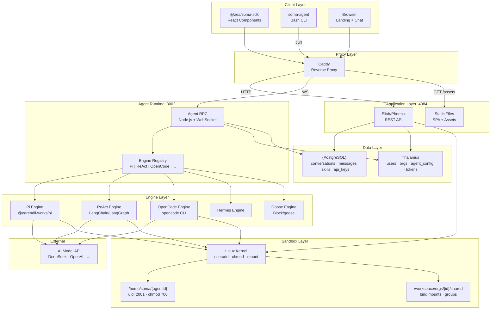
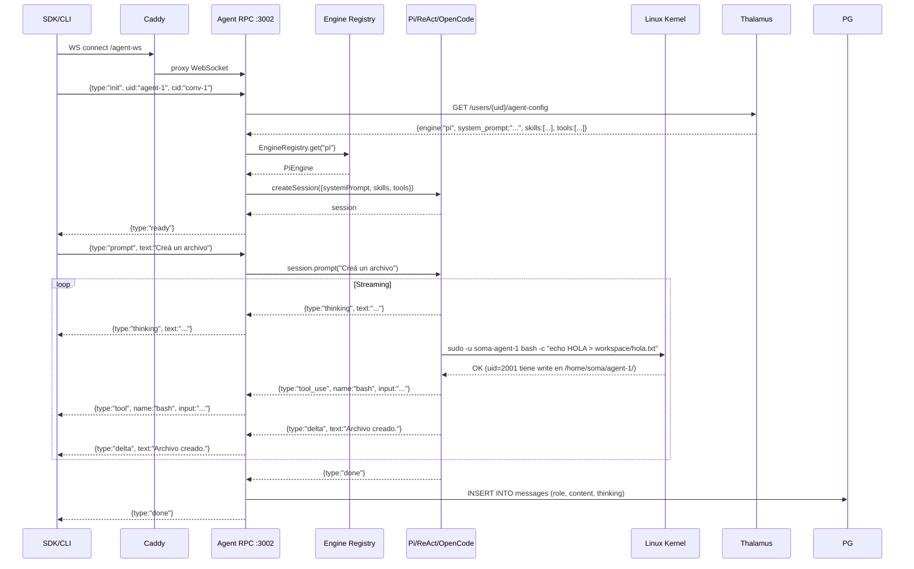
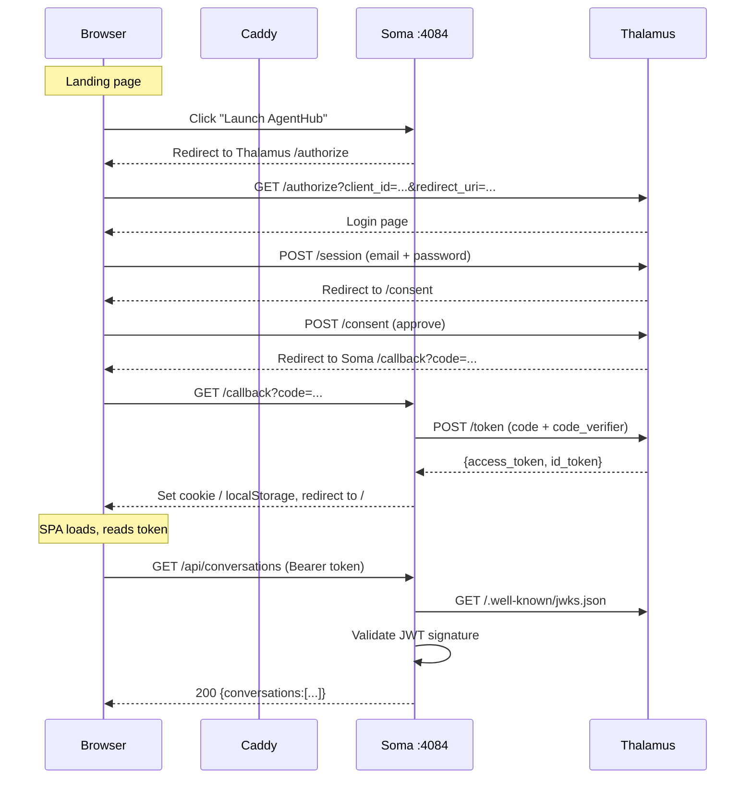

# Design Document — Soma AgentHub v2

## Overview

Soma AgentHub is a multi-engine, multi-tenant platform where AI agents run as real Linux users with kernel-enforced isolation. The architecture has 4 layers: a React SDK (`@zea/soma-sdk`) for the UI, an Elixir/Phoenix API for REST endpoints, a Node.js Agent RPC server for WebSocket-based agent sessions, and a pluggable engine layer that routes each agent to its configured AI engine.

### Key Design Decisions

1. **WebSocket protocol is engine-agnostic** — All engines (Pi, ReAct, OpenCode, Hermes, Goose) emit the same event types (`thinking_start`, `thinking`, `delta`, `tool_use`, `done`). The client never knows which engine is running.

2. **Agents = Linux users** — Each agent gets `useradd` with its own UID, `/home/soma/{id}`, and groups. The kernel enforces isolation (`chmod 700`). No application-level path traversal checks needed.

3. **Elixir for REST, Node.js for WebSocket** — Elixir/Phoenix handles HTTP (auth, CRUD, static files) with Plug pipeline. Node.js handles long-lived WebSocket connections and engine orchestration.

4. **Pluggable identity service** — Thalamus is the default, but the `AgentConfig` interface is abstracted. Local JSON files serve as fallback. The SDK can also accept `agentConfig` directly.

5. **CLI in bash** — `soma-agent` is a bash script that wraps `curl` calls to the REST API. No Node.js, no dependencies beyond bash+curl+jq.

6. **SDK as standalone npm package** — `@zea/soma-sdk` depends only on `react` and `react-dom`. CSS is self-contained via `--glia-*` variables. All backends are swappable via provider interfaces.

---

## Architecture

### High-Level System Architecture



### Data Flow: WebSocket Agent Session



---

## DB Schema

### PostgreSQL (Soma)

```sql
-- Conversations
CREATE TABLE conversations (
    id TEXT PRIMARY KEY,                    -- dm:{agentId} o UUID
    organization_id UUID NOT NULL,
    user_id TEXT NOT NULL,
    agent_id TEXT,
    app_context TEXT,
    title TEXT,
    last_message_at TIMESTAMPTZ DEFAULT now(),
    message_count INTEGER DEFAULT 0,
    is_deleted BOOLEAN DEFAULT false,
    created_at TIMESTAMPTZ DEFAULT now()
);

-- Messages
CREATE TABLE messages (
    id UUID PRIMARY KEY DEFAULT gen_random_uuid(),
    conversation_id TEXT NOT NULL REFERENCES conversations(id) ON DELETE CASCADE,
    role TEXT NOT NULL CHECK (role IN ('user', 'assistant', 'system')),
    content TEXT NOT NULL,
    thinking TEXT,
    tools JSONB,                            -- [{name, input, result}]
    created_at TIMESTAMPTZ DEFAULT now()
);

CREATE INDEX idx_messages_conv ON messages(conversation_id, created_at);
CREATE INDEX idx_conversations_org ON conversations(organization_id, last_message_at DESC);
CREATE INDEX idx_conversations_user ON conversations(user_id, last_message_at DESC);

-- API Keys
CREATE TABLE api_keys (
    id UUID PRIMARY KEY DEFAULT gen_random_uuid(),
    organization_id UUID NOT NULL,
    name TEXT NOT NULL,
    key_hash TEXT NOT NULL UNIQUE,           -- SHA-256 of raw key
    key_prefix TEXT NOT NULL,                -- 'zs_live_'
    scopes TEXT[] DEFAULT '{soma:read,soma:write}',
    is_active BOOLEAN DEFAULT true,
    last_used_at TIMESTAMPTZ,
    created_at TIMESTAMPTZ DEFAULT now()
);

CREATE INDEX idx_api_keys_hash ON api_keys(key_hash);
CREATE INDEX idx_api_keys_org ON api_keys(organization_id);

-- Custom Skills
CREATE TABLE custom_skills (
    id UUID PRIMARY KEY DEFAULT gen_random_uuid(),
    organization_id UUID NOT NULL,
    name TEXT NOT NULL,
    content TEXT NOT NULL,
    is_active BOOLEAN DEFAULT true,
    created_at TIMESTAMPTZ DEFAULT now(),
    updated_at TIMESTAMPTZ DEFAULT now(),
    UNIQUE(organization_id, name)
);

CREATE INDEX idx_custom_skills_org ON custom_skills(organization_id);
```

### Filesystem

```
/home/soma/
├── {agentId}/                       ← chmod 700, owned by soma-{id}
│   ├── workspace/                   ← private work directory
│   ├── .config/                     ← agent config cache
│   ├── .pi-sessions/                ← Pi session persistence
│   ├── shared/                      ← bind mount → /workspace/orgs/{orgId}/shared
│   └── {mount-name}/                ← bind mounts adicionales
├── _bootstrap/                      ← templates (.bashrc, .gitconfig)

/workspace/
├── orgs/{orgId}/
│   ├── shared/                      ← chmod 770, group org-{id}
│   ├── apps/{app}/
│   │   ├── AGENTS.md
│   │   └── .git/
│   └── .git/
└── teams/{teamId}/
    └── {project}/

/root/.agents/
├── skills/                          ← builtin skills (SKILL.md per dir)
├── agent-configs/{userId}.json      ← local config fallback
└── skills-custom/                   ← custom skills from API
    └── .registry.json               ← skill → agent mapping

/app/.pi-agent-messages/             ← file-based fallback (no DB)
/app/.pi-agent-skills/               ← custom skills filesystem
/app/.pi-agent-sessions/             ← Pi session dirs
```

---

## Endpoints · Request/Response

### REST API (Elixir :4084)

```
Health
  GET /health → 200 {status:"ok", service:"soma"}

Auth
  GET  /api/conversations          → 200 {conversations:[...]}
  GET  /api/conversations/:id      → 200 {id, messages:[...]}
  POST /api/conversations/:id/messages → 201 {data:{id,role,content,...}}
  DELETE /api/conversations/:id    → 200 {deleted:true}

Files (Workspace API)
  GET    /api/files?path={p}       → 200 {files:[{name,type,size,ext}]}
  GET    /api/files/content?path=p → 200 (file content)
  POST   /api/files/upload         → 200 {ok:true, path, size}
  POST   /api/files/mkdir          → 200 {ok:true, path}
  PUT    /api/files/rename         → 200 {ok:true, path}
  POST   /api/files/move           → 200 {ok:true, path}
  DELETE /api/files?path=p         → 200 {ok:true}
  GET    /api/files/history?path=p → 200 {commits:[{hash,message}]}
  POST   /api/files/recover        → 200 {ok:true, path}
  POST   /api/files/push           → 200 {ok:true, output}

Skills
  GET    /api/skills               → 200 {data:[{name,description,custom}], total}
  GET    /api/skills/:name         → 200 {name, content, source:"builtin"|"custom"}
  POST   /api/skills               → 201 {data:{name,...}}
  PUT    /api/skills/:name         → 200 {data:{name,...}}
  DELETE /api/skills/:name         → 204
  PUT    /api/skills/:name/agents  → 200 {name, assigned_to:[...]}

Agents
  GET    /api/agents               → 200 {data:[{id,email,is_agent,agent_config}]}
  GET    /api/agents/:id           → 200 {data:{id,...}}
  POST   /api/agents               → 201 {data:{id,...}}         ← NUEVO v2
  PUT    /api/agents/:id/config    → 200 {ok:true, config:{...}}
  DELETE /api/agents/:id           → 200 {deleted:true}          ← NUEVO v2

Sandbox (OS-level)                                                     ← NUEVO v2
  POST   /api/agents/:id/sandbox        → 200 {ok:true, uid, home}
  DELETE /api/agents/:id/sandbox        → 200 {ok:true}
  POST   /api/agents/:id/sandbox/mounts → 200 {ok:true, mounts:[...]}
  GET    /api/agents/:id/sandbox/mounts → 200 {mounts:[{source,dest,ro}]}
  DELETE /api/agents/:id/sandbox/mounts/:mount → 200 {ok:true}

Engines                                                               ← NUEVO v2
  GET    /api/engines               → 200 {engines:[{name,status}]}
  GET    /api/engines/:name         → 200 {name, description, status}

API Keys
  POST   /api/api-keys              → 201 {api_key:"zs_live_...", prefix:"zs_live_"}

Auth (Browser)
  GET    /                           → index.html (SPA)
  GET    /assets/*                   → static files
  *      (catch-all)                 → index.html (SPA routing)
```

### WebSocket Protocol (Agent RPC :3002)

```
Client → Server:
  {type:"init", uid:string, cid:string}
  {type:"prompt", text:string}
  {type:"cancel"}

Server → Client:
  {type:"ready"}
  {type:"thinking_start"}
  {type:"thinking", text:string}
  {type:"thinking_end"}
  {type:"delta", text:string}
  {type:"tool", name:string, input:unknown}
  {type:"tool_result", content:string}
  {type:"done"}
  {type:"cancelled"}
  {type:"error", message:string}
```

---

## Component Tree

```
App (React SPA)
├── Landing
│   ├── Navbar (logo, Docs, Launch AgentHub)
│   ├── Hero
│   │   ├── Badge (Multi-engine · OS sandboxes · CLI-first)
│   │   ├── Headline + Subtitle
│   │   ├── CTA Buttons (Launch, Read Docs)
│   │   └── Terminal Preview (soma-agent agent create...)
│   ├── How it Works (6 cards: Agent=User, chmod 700, Bind Mounts, sudo -u, Engine, Multi-Tenant)
│   ├── For Developers (CLI commands grid + CI/CD code example)
│   ├── For Companies (Enterprise features grid + filesystem hierarchy diagram)
│   ├── Multi-Engine (Engine cards: Pi, ReAct, OpenCode, Hermes, Goose)
│   ├── CTA (Start deploying agents today)
│   └── Footer
│
├── Login (OAuth2 redirect)
│
└── ChatView (authenticated)
    ├── Sidebar
    │   ├── ZEA Logo
    │   ├── MANAGEMENT (Users/Agents, Organizations, API Keys)
    │   ├── WORKSPACE (Files, Skills, Workflows)
    │   ├── MESSAGES (channel list)
    │   ├── DIRECT MSGS (agent list with online status)
    │   └── User Footer (avatar, name, logout)
    ├── Handle (resizable)
    ├── Main Content
    │   ├── Header (Agents Hub, Hide Chat toggle)
    │   └── Welcome content (steps, also section)
    ├── Handle (resizable)
    └── GliaChat (agent chat panel)
        ├── Messages Feed
        │   ├── Welcome Message (if empty)
        │   ├── MessageBubble (user) → renderMarkdown
        │   ├── MessageBubble (assistant) → renderMarkdown
        │   │   └── ThinkingBlock (collapsible, if msg.thinking)
        │   └── StreamingView (during agent response)
        │       ├── ThinkingBlock (live, collapsible)
        │       ├── ToolCall (name + input)
        │       ├── ToolResult (formatted output)
        │       └── StreamText (live delta)
        └── Input Area
            ├── Textarea
            ├── Send Button / Cancel Button
            └── "Pensando..." indicator
```

---

## Engine Interface (TypeScript)

```typescript
// server/engines/types.ts

export interface AgentConfig {
  systemPrompt: string | null
  skillPaths: string[]
  tools: string[]
  workspacePaths: string[]
  engine?: string
  sessionDir: string
  modelRegistry: ModelRegistry
  authStorage: AuthStorage
  resourceLoader?: ResourceLoader
}

export interface StreamEvent {
  type: 'thinking_start' | 'thinking' | 'thinking_end'
       | 'delta' | 'tool_use' | 'tool_result'
       | 'done' | 'error'
  text?: string
  name?: string
  input?: unknown
  content?: string
  message?: string
}

export interface AgentSession {
  prompt(text: string): Promise<void>
  subscribe(callback: (event: StreamEvent) => void): void
  abort(): Promise<void>
}

export interface AgentEngine {
  name: string
  createSession(config: AgentConfig): Promise<AgentSession>
}
```

---

## SDK Public API

```typescript
// @zea/soma-sdk

// Components
import { GliaChat, GliaCopilot, GliaConversationList, GliaFileBrowser, GliaSkillEditor } from '@zea/soma-sdk'

// Hooks
import { useGlia, useGliaConversations, useGliaFiles, useGliaSkills, useGliaAgents } from '@zea/soma-sdk'

// CSS (standalone — no ZEA dependency)
import '@zea/soma-sdk/styles/base.css'

// Types
import type { GliaMessage, GliaChatProps, UseGliaOptions, UseGliaReturn } from '@zea/soma-sdk'

// Portability options (v2)
interface UseGliaOptions {
  agentId: string
  conversationId?: string
  baseUrl?: string
  wsPath?: string                    // default: '/agent-ws'          ← NUEVO
  apiPrefix?: string                 // default: '/api/v1'            ← NUEVO
  authHeaders?: () => Record<string, string>                        ← NUEVO
  onAuthError?: (status: number) => void                            ← NUEVO
  agentConfig?: {                    // bypass identity service      ← NUEVO
    systemPrompt?: string
    tools?: string[]
    engine?: string
    skills?: string[]
  }
  onDelta?: (text: string) => void
  onThinking?: (text: string) => void
  onTool?: (name: string, input: unknown) => void
  onDone?: () => void
  onCancelled?: () => void
  onError?: (message: string) => void
}
```

---

## CLI Implementation Strategy

```bash
# scripts/soma-agent — entry point
# Pure bash, wraps curl + jq. Each subcommand is a sourced script.

scripts/
├── soma-agent                     # Entry point (case dispatch)
└── commands/
    ├── agent.sh                   # create, list, show, config, sandbox, destroy
    ├── skill.sh                   # list, show, create, edit, delete, assign
    ├── workspace.sh               # list, upload, download, mkdir, rm
    ├── engine.sh                  # list, info
    ├── conversation.sh            # list, show, chat (interactive WS)
    ├── doctor.sh                  # run, watch
    └── auth.sh                    # login (OAuth2 PKCE), logout, whoami, token

# Auth flow:
# soma-agent auth login → opens browser → OAuth2 PKCE → exchanges code → saves token
# soma-agent auth token → POST /api/api-keys → returns zs_live_... → saves to env
```

---

## Testing Strategy

### Unit Tests (Elixir/ExUnit)
- **Scope**: Every module in `lib/soma/` and `lib/soma_web/`
- **Mocks**: `Soma.Skills` (mock Thalamus HTTP), `Soma.Workspace` (mock filesystem), `SomaWeb.Plugs.JWTAuth` (mock JWKS)
- **Coverage target**: 80%+
- **Location**: `test/soma/`

### Integration Tests (Elixir/ExUnit + real DB)
- **Scope**: Full stack from API endpoint to PostgreSQL
- **Database**: Test database with migrations run before suite
- **Key flows**: API key create→validate, skill create→list→delete, conversation create→add message→list→soft delete, file upload→list→history→recover→delete
- **Location**: `test/soma/`

### E2E Tests (Playwright)
- **Scope**: Headless browser → full user flow
- **Key scenarios**:
  - Landing → Login → Auth → Consent → Chat → Send message → Verify response persists with thinking → Send second message → Verify both responses visible
  - Chat → Send → Cancel mid-stream → Verify cancelled state
- **Evidence**: Screenshots at each step saved to `/tmp/soma-e2e/`, browser console logs saved to `/tmp/soma-e2e/browser-logs.txt`
- **Location**: `e2e/soma-multiturn.js`

### Health Check (Doctor)
- **Scope**: 13 layers from HTTP to E2E
- **Execution**: `./doctor-soma.sh` or `soma-agent doctor run`
- **Exit code**: 0 = all pass, 1 = failures
- **Location**: `doctor-soma.sh`

### Engine Integration Tests (Python + WebSocket)
- **Scope**: Direct WebSocket connection → init → prompt → verify events
- **Key scenarios**: Pi engine responds, cancel works, multiple sessions, engine registry routes correctly
- **Location**: Embedded in `doctor-soma.sh` (Python inline)

---

## Auth Flow



---

## Deployment Architecture

```yaml
# docker-compose (simplified)
services:
  soma:
    build: .
    volumes:
      - soma_agents:/home/soma          # Agent home directories
      - soma_orgs:/workspace/orgs       # Organization workspaces
      - ./agent-configs:/root/.agents/agent-configs
    cap_add: [SYS_ADMIN]                # Required for mount --bind
    depends_on: [postgres]

  caddy:
    image: caddy:2
    volumes:
      - ./Caddyfile:/etc/caddy/Caddyfile
    ports:
      - "80:80"
      - "443:443"

volumes:
  soma_agents:
  soma_orgs:
```
